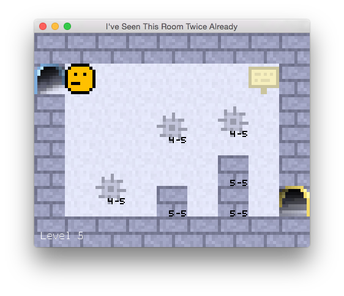

# I've Seen This Room Twice Already

This is my [entry for Ludum Dare edition #37](http://ludumdare.com/compo/ludum-dare-37/?action=preview&uid=46246), a competition where you have 72 hours to program a game from scratch. The theme for this edition was "One Room", and so I decided to make a sequel to the first game I made for Ludum Dare, [I've Seen This Room Before](https://github.com/gelisam/ludum-dare-31). I wrote that first game in Haskell, this time I'm using Rust! I like languages with fancy type systems :)
